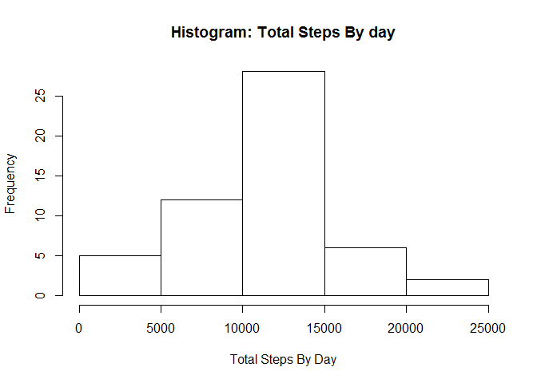
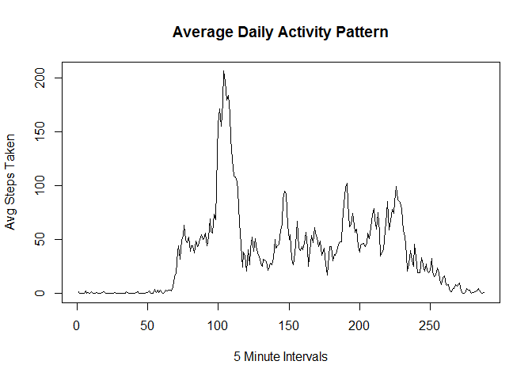
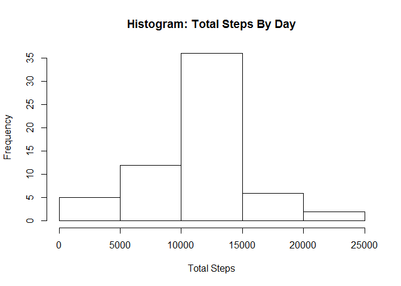
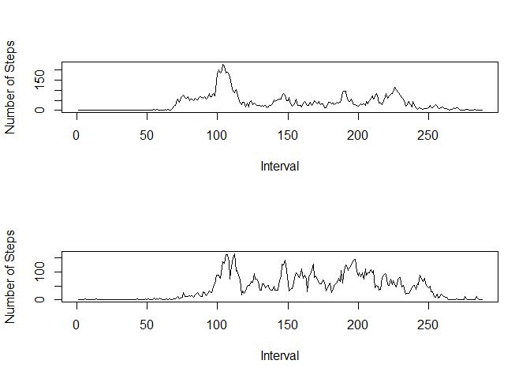

# Reproducible Research: Peer Assessment 1
====================================================================================  

## Loading and preprocessing the data
The data has been provided in a csv file.  Using the read.csv file, you can extract the data from the csv file and store it in a data frame to use later.  


```r
data <- read.csv("activity.csv", header = TRUE, sep = ",", colClasses = c("integer", "Date", "integer"))
```

Now that the data has been loaded into a data frame, it is necessary to clean it (i.e. Remove null values from the Steps columns).

```r
stepNull <- is.na(data$steps)
clean <- data[!stepNull,]
```

Both the data and clean data frames will be utilized below in order to answer questions accordingly.

## What is mean total number of steps taken per day?
In order to calculate the mean total number of steps, we will be using the clean data frame.  It is important to keep in mind that there could be several step entries per day.  It is for that reason that it will be necessary to sum the step values by day.

```r
##split list by date
dateSplit <- split(clean$steps, clean$date)
##sum by date
dateSums <- sapply(dateSplit, sum)
```
Now that the total steps per day have been calculated, they will be presented using a histogram.

```r
hist(dateSums, main = "Histogram: Total Steps By day", xlab = "Total Steps By Day")
```

 

The last step will be calculating the Mean and Median of the clean step data.

```r
##calculate Average Steps by Date
meanSteps <- mean(dateSums)
medianSteps <- median(dateSums)
```
The results for the Mean and Median include:
Average Steps: 1.0766189\times 10^{4}
Median: 10765

## What is the average daily activity pattern?
In order to calculate the average daily activity over 5 minute intervals, it will be important to begin by calculating the mean by intervals (using the interval column from the file).  This will then be displayed using a time series plot.

```r
intervalSplit <- split(clean$steps, clean$interval)
meanInterval <- sapply(intervalSplit, mean)

plot(meanInterval, type = "l", main = "Average Daily Activity Pattern", xlab = "5 Minute Intervals", ylab = "Avg Steps Taken")
```

 

It is important to determine the 5 minute interval with the max steps taken

```r
minInt <- names(meanInterval)[which.max(meanInterval)]
```
It was determined that 835 was the five minute interval with the max number of steps taken.

## Imputing missing values
The original data set had several missing 'NA' values.

```r
cntMissing <- sum(is.na(data))
```
There are 2304 'NA' Values in the original data set.

In order to deal with these 'NA' values, the mean of the five minute interval will be used to fill in these values.

```r
##Add column containing mean for 5 minute interval
newData <- merge(data, data.frame(meanInterval), by.x = "interval", by.y = "row.names")
##Replace the steps value with the 5 min interval from the meanInterval column
newData$steps[is.na(newData$steps)] <- newData$meanInterval[is.na(newData$steps)]
##Check to make sure all zero step values have been removed
sum(is.na(newData$steps))
```

```
## [1] 0
```

```r
##Remove column containing mean value
newData$meanInterval <- NULL
```

Here is an updated histogram for the new data frame.

```r
##Group data by day
newSplit <- split(newData$steps, newData$date)
##calculate sum per day
newDateSum <- sapply(newSplit, sum)
##Draw Histogram
hist(newDateSum, main = "Histogram: Total Steps By Day", xlab = "Total Steps")
```

 

```r
##Calculate Mean
newMean <- mean(newDateSum)
##CalculateMedian
newMedian <- median(newDateSum)
```
The results for the new data frame are:
- Mean: 1.0766189\times 10^{4} 
- Median: 1.0766189\times 10^{4}

## Are there differences in activity patterns between weekdays and weekends?
This section includes an evalution of the data from a weekday and weekend perspective.

```r
##add weekdays column to data frame
wdata <- newData
wdata$weekday <- weekdays(newData$date)
wdata$weekend <- ifelse(weekdays(newData$date) %in% c("Sunday","Saturday"),"Weekend","Weekday")
##Split data frames
dayData <- wdata[wdata[,"weekend"] == "Weekday",]
endData <- wdata[wdata[,"weekend"] == "Weekend",]

## plot 
par(mfrow = c(2,1))
plot(sapply(split(dayData$steps, dayData$interval),mean), type="l", xlab = "Interval", ylab = "Number of Steps")
plot(sapply(split(endData$steps, endData$interval),mean), type="l", xlab = "Interval", ylab = "Number of Steps")
```

 
